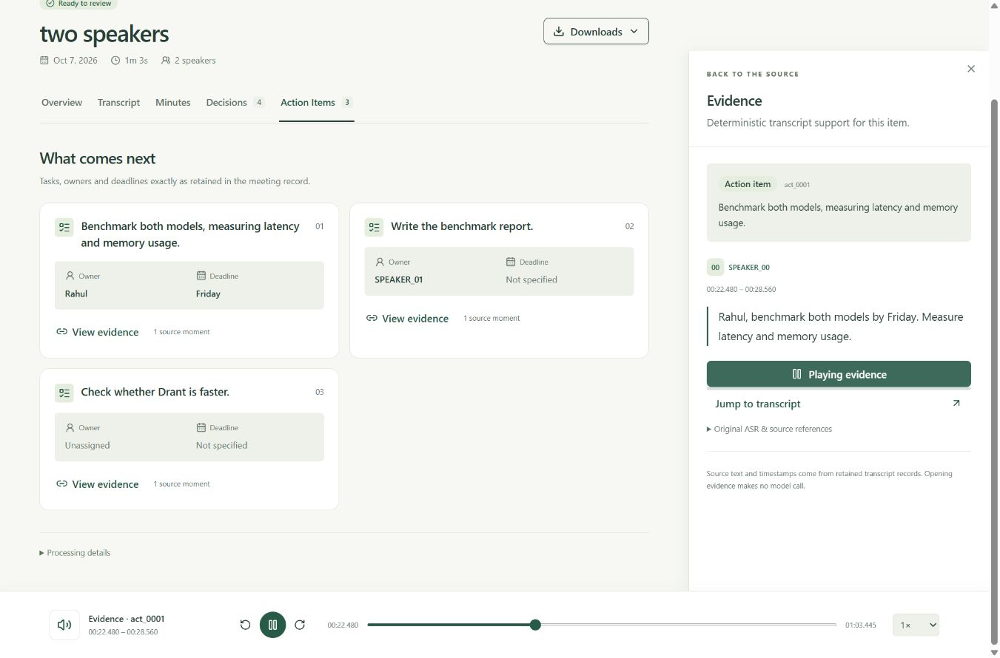
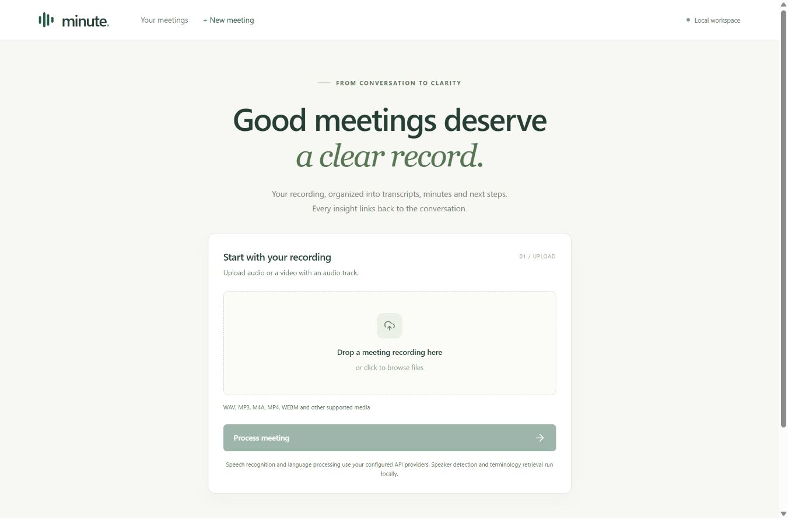
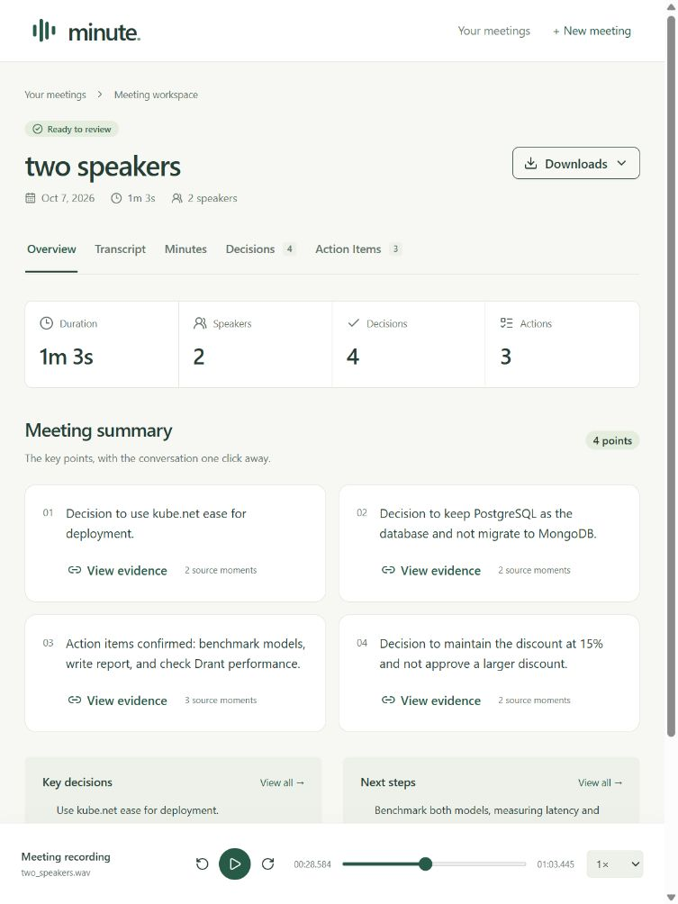
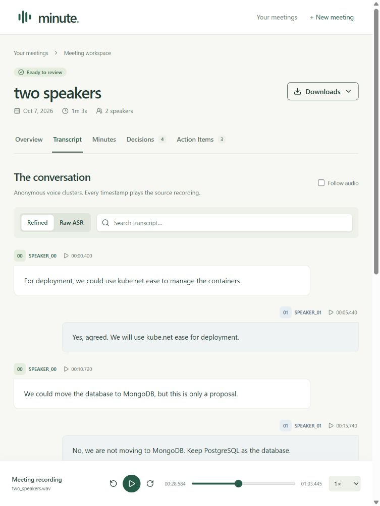
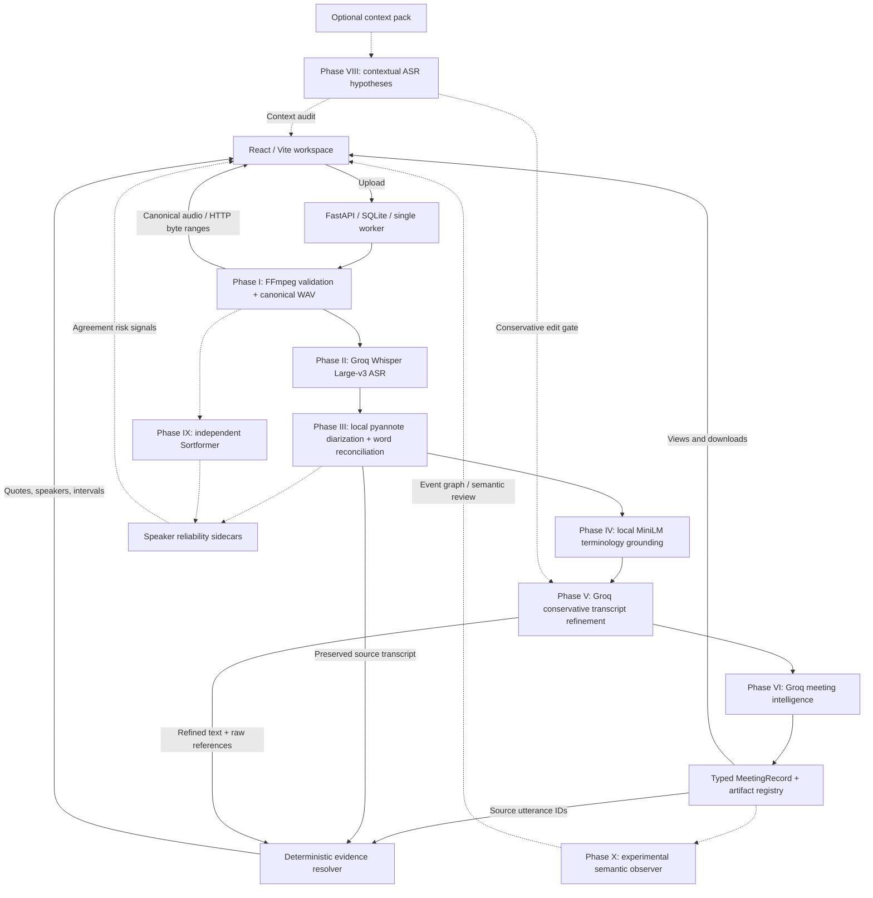

# minute. — Evidence-grounded AI meeting assistant

Turn a meeting recording into a timestamped transcript, structured minutes, decisions and action items—with source evidence you can read and play back.

Built for the Inter-IIT ML Bootcamp. The current application combines hosted speech/text inference with local speaker diarization and terminology retrieval, in a responsive meeting workspace.



## What it does

- Accepts audio or video containing audio; validates and converts it to 16 kHz mono PCM WAV.
- Transcribes English speech with Groq Whisper Large-v3, retaining raw segments and word timestamps.
- Groups speech by anonymous speakers with local pyannote Community-1.
- Retrieves technical terminology from 3,590 curated concepts across 17 domains, then applies conservative, logged corrections.
- Produces summaries, topical minutes, decisions and action items; missing owners/deadlines remain explicit.
- Opens source evidence, jumps to cited transcript utterances and plays their audio intervals.
- Preserves raw vs refined transcripts, correction logs and downloadable JSON, TXT and Markdown artifacts.
- Retains local job history, stage progress and failures without automatically rerunning paid work.
- Supports optional meeting context and bounded contextual re-ASR through the CLI/Python API. Alternative hypotheses pass through the existing conservative refinement gate; raw ASR stays immutable. See [Phase VIII](docs/phase8-contextual-asr.md).

## Why evidence matters

```text
Generated claim → source utterance IDs → speaker + preserved transcript
                → resolved timestamps → source recording playback
```

The language model supplies source IDs. Code validates those references and resolves quotes, timestamps and raw-word provenance from retained transcript artifacts. It does not ask the model to invent evidence timestamps. Opening evidence and downloading a result make no new model calls.

This makes outputs inspectable; it **does not prove that a claim is semantically correct**. Speech recognition, speaker attribution, corrections and extraction can still make errors.

## Application

| Upload | Meeting overview | Conversation transcript |
|---|---|---|
|  |  |  |

These screenshots show an original, locally synthesized two-voice fixture, not a private recording. See [screenshot provenance](docs/assets/README.md). Visible recognition errors are retained.

**Demo workflow:** upload → follow six processing stages → review Overview / Transcript / Minutes / Decisions / Action Items → open evidence → play its interval or jump to the transcript → download the original artifacts.

### Phase XI — Trust-aware workspace

The workspace now reads saved context audits, independent speaker comparisons and
experimental semantic observations. Overview separates reliability dimensions;
transcript badges open the shared evidence drawer; Decision Evolution and Review
link observations to the existing source audio and transcript. Missing diagnostics
leave canonical results usable. Opening any view makes no model call.

Contextual ASR has no measured terminology gain in the current baseline. Speaker
agreement measures consistency, not correctness. The local semantic observer performed
poorly and cannot approve, remove or change canonical decisions or actions.


See [Phase XI behavior and API](docs/phase11-trust-aware-ui.md) and
[tests, responsive checks and screenshots](docs/phase11-validation.md).

## Architecture



Each phase has a separate typed public interface. The application calls those interfaces and reuses local model instances. Raw ASR is retained separately from refined text and generated claims.

| Component | Validated baseline |
|---|---|
| Backend | Python 3.12.14, FastAPI 0.142.2, Uvicorn 0.54.0, SQLite |
| Frontend | React 19.3.0, TypeScript 5.9.3, Vite 8.3.3 |
| UI | Tailwind 4.3.3, local shadcn/ui components, Radix, Lucide |
| Speech | Groq `whisper-large-v3`; optional OpenAI `whisper-1` ASR adapter |
| Speakers | pyannote.audio 4.0.7 / `pyannote/speaker-diarization-community-1` |
| Terminology | `sentence-transformers/all-MiniLM-L6-v2`, RapidFuzz 3.14.6, Jellyfish 1.2.1 |
| Refinement / intelligence | Two distinct inference roles using Groq `openai/gpt-oss-120b`, temperature 0 |
| Audio | External FFmpeg + ffprobe; WAV / `pcm_s16le` / 16,000 Hz / mono / 16 bits |

## Repository structure

```text
src/meeting_assistant/
  audio/          # validation, normalization, metadata
  asr/            # replaceable hosted Whisper adapter, raw transcript
  diarization/    # local model and speaker/word reconciliation
  grounding/      # terminology evidence + packaged glossary
  refinement/     # conservative edits and audit log
  intelligence/   # meeting record and deterministic evidence
  contextual_asr/ # optional context and selective second-pass hypotheses
  speaker_reliability/ # optional independent diarizer agreement
  semantic_reasoning/ # experimental event and claim observations
  web/            # REST API, orchestration, SQLite, artifact serving
frontend/         # React/TypeScript workspace and interaction tests
data/             # small authored benchmark definitions, not runtime meetings
scripts/          # fixture generators and glossary maintenance
requirements/     # validated Windows/Python dependency snapshots
tests/           # backend regression tests
docs/            # contracts, setup, measured validation, screenshots
```

## Setup: validated Windows environment

The complete workflow was validated on **Windows 11 x64, Python 3.12.14, Node 24.20.0 / npm 11.19.0, an RTX 4070 Laptop GPU (8 GB), and Torch 2.8.0+cu128**. Linux/macOS full-pipeline setup has not been validated. Package metadata permits Python 3.11+, but the ML snapshots below target Python 3.12 on Windows.

### 1. Install external prerequisites

Install Python 3.12, Node.js, and **both FFmpeg and ffprobe** from an appropriate [FFmpeg distribution](https://ffmpeg.org/download.html). Ensure they are on PATH, or set `FFMPEG_PATH` / `FFPROBE_PATH` in `.env` to your executable paths without extra flags. No FFmpeg binaries are included in Git.

Use an NVIDIA driver compatible with the selected CUDA wheel. The validated GPU setup used driver 596.49 and CUDA 12.8 wheels; it did not require installing a global CUDA toolkit or replacing the driver. See [the environment record](docs/phase3-environment.md).

### 2. Create the Python environment and install the full stack

From the repository root, in PowerShell with Python 3.12 selected:

```powershell
python -m venv .venv
.\.venv\Scripts\Activate.ps1
python -m pip install torch==2.8.0 torchaudio==2.8.0 --index-url https://download.pytorch.org/whl/cu128
python -m pip install -r requirements/grounding-windows-py312.lock.txt
python -m pip install -r requirements/web-windows-py312.lock.txt
python -m pip install -e ".[diarization,grounding,web,web-test]"
python -m pip check
```

The grounding snapshot includes the combined Phase III/IV dependencies; the web snapshot supplements it. Install the CUDA wheels first because the `+cu128` pins are not ordinary PyPI wheels. `.[web,web-test]` alone installs the application layer, **not the local ML stack**. The snapshots are exact resolved versions, not universal cross-platform locks.

For an explicit CPU fallback, install the appropriate CPU Torch/TorchAudio wheels and set `DIARIZATION_DEVICE=cpu`; do not use the GPU snapshot's `+cu128` pins unchanged. CPU diarization was tested, but is slower. There is no silent GPU-to-CPU fallback.

### 3. Configure credentials and acquire local models

On a fresh checkout:

```powershell
Copy-Item .env.example .env
# Edit .env locally. Do not commit or share keys.
```

Set **`GROQ_API_KEY`** for the default ASR/refinement/intelligence workflow. For Community-1 acquisition, accept the access conditions on its [Hugging Face model page](https://huggingface.co/pyannote/speaker-diarization-community-1) and set **`HF_TOKEN`** to an authorized read token.

```powershell
python -m meeting_assistant.diarization --prepare-model
python -m meeting_assistant.diarization --verify-model
python -m meeting_assistant ground --prepare-model
python -m meeting_assistant ground --verify-model
```

Run acquisition in a fresh online process with `HF_HUB_OFFLINE` unset. Preparation is an explicit download operation; inference verifies local caches and fails clearly if they are missing. Default storage is approximately **32.8 MB** for Community-1 and **92 MB** for MiniLM, excluding Python/Torch dependencies and vector caches. These models and caches are ignored by Git. **No local Whisper checkpoint is needed by the current API backend.**

See [diarization setup](docs/diarization-setup.md) and [grounding setup/contracts](docs/phase4-grounding.md) for revisions, provenance checks and CPU behavior.

### 4. Build and run

```powershell
cd frontend
npm ci
npm run build
cd ..
python -m meeting_assistant.web
```

After starting the server, open **http://127.0.0.1:8000**. This is a local application URL, not a hosted demo. Use one process/worker without reload mode for GPU jobs.

For frontend development, run `npm run dev` under `frontend/` alongside the backend. Vite proxies `/api` to port 8000. See [application setup and REST contracts](docs/phase7-application.md).

## Environment variables

[`.env.example`](.env.example) contains supported settings and empty credentials. Process environment variables override `.env`; the web server reads configuration at startup.

| Variable | Default / purpose |
|---|---|
| `GROQ_API_KEY` | Required for the default hosted workflow; empty in the example |
| `OPENAI_API_KEY` | Optional alternative ASR credential; refinement/intelligence still use Groq |
| `ASR_PROVIDER` / `ASR_MODEL` | `groq` / provider default `whisper-large-v3`; OpenAI default is `whisper-1` |
| `ASR_LANGUAGE` / `ASR_TEMPERATURE` | `en` / `0`; raw native segment + word timestamps |
| `ASR_CHUNK_SECONDS` | `600`; also bounded by upload size |
| `HF_TOKEN` | Initial gated model acquisition, not local diarization inference |
| `DIARIZATION_DEVICE` | `cuda`; explicit `cpu` fallback |
| `DIARIZATION_MODEL_CACHE` | `.models/diarization/community-1` |
| `DIARIZATION_OFFLINE_ONLY` | `true`; explicit preparation downloads the checkpoint |
| `GROUNDING_MODEL_CACHE` / `GROUNDING_INDEX_CACHE` | `.models/grounding/minilm` / `.cache/grounding` |
| `GROUNDING_OFFLINE_ONLY` | `true`; normal grounding inference is local |
| `REFINER_MODEL` / `INTELLIGENCE_MODEL` | `openai/gpt-oss-120b` for both roles |
| `FFMPEG_PATH` / `FFPROBE_PATH` | Resolve on PATH unless explicitly configured |
| `WEB_HOST` / `WEB_PORT` | `127.0.0.1` / `8000` |
| `WEB_JOB_ROOT` / `WEB_MAX_ACTIVE_JOBS` | `jobs/web` / `1` |
| `WEB_MAX_UPLOAD_BYTES` | `4294967296` (4 GiB); later stage/context limits still apply |

Full timeout, retry, retrieval and context limits are documented in the phase guides. Do not place credentials in frontend variables or bundles.

## Privacy and outputs

**The current full pipeline is not offline.** Audio chunks are uploaded to the configured ASR provider (Groq by default, OpenAI optionally). Bounded transcript/evidence text is sent to Groq for refinement and intelligence. Diarization and MiniLM retrieval run locally after model acquisition. Only submit recordings you are authorized to process with those providers.

Uploads, canonical audio, transcripts and SQLite history remain under ignored `jobs/web/`; there is no automatic retention/deletion policy. Changing the job directory requires updating ignore rules. This local application has no authentication or cloud multi-tenancy: keep it off public networks.

```text
jobs/web/
  meetings.sqlite3
  <meeting-uuid>/
    upload/source.media
    audio/canonical.wav
    transcripts/<stage-result-uuid>/...
```

| Artifact | Purpose |
|---|---|
| `canonical.wav` | Verified lossless PCM WAV used by all later stages |
| `raw_transcript.json` / `.txt` | Immutable native ASR segments, words and timing |
| `diarization.json`, `speaker_transcript.json` / `.txt` | Speaker turns and reconciliation provenance |
| `grounding.json` / `.txt` | Retrieved terminology candidates and source evidence |
| `refined_transcript.json` / `.txt`, `edit_log.json` | Conservative corrections and original evidence |
| `meeting_record.json` / `.md` | Typed claims and matching human-readable meeting record |
| `evidence_manifest.json` | Deterministically resolved evidence references |

Downloads serve the original registered files. JSON, Markdown and the UI derive from the same canonical records rather than independently regenerated summaries.

## Tests and measured results

Fresh Phases VIII–XI integration checks on **2026-10-08**:

- Backend: **772 tests; 747 passed, 25 skipped**, including all 13 real FFmpeg integration tests. Skips cover live-provider/local-model opt-ins and two Windows symlink privilege cases.
- Ruff lint and format checks, compilation and main/optional-environment `pip check`: passed.
- Frontend: **37/37 tests**, ESLint, TypeScript and production build: passed. Dependency installation was retained for this integration; no fresh `npm ci` or vulnerability audit was run.

```powershell
python -m unittest discover -s tests -t .
ruff check src tests scripts
ruff format --check src tests scripts
python -m compileall -q src tests scripts
python -m pip check
cd frontend
npm ci
npm run lint
npm run typecheck
npm test
npm run build
```

Install Ruff separately as developer tooling (release validation used 0.16.10). If FFmpeg is configured only in `.env`, export its executable paths into the test process environment; set `REQUIRE_FFMPEG_TESTS=1` to fail rather than skip missing FFmpeg. Standard tests do not call hosted models. Keep `RUN_ASR_API_TESTS`, `RUN_REFINER_API_TESTS` and `RUN_INTELLIGENCE_API_TESTS` unset; these are explicit billed opt-ins.

The earlier cached GPU/CPU model regression run passed **531/542, with 11 skipped**, including socket-blocked local-model tests. It is historical validation, not a claim those opt-ins were rerun for release.

An actual synthetic two-voice browser run processed **63.445 seconds** of audio in **54.555 seconds** including model preparation/backoff; it produced 10 ASR segments, 122 words, two anonymous speakers, four summary points, ten minutes, four decisions and three actions. Evidence for the benchmark action resolved to **22.480–28.560 seconds**. These are fixture measurements, not a human-meeting accuracy benchmark. Observed errors included `kube.net ease` and `Drant`; they remain in the screenshots and outputs.

Evaluate retained ASR without another provider call:

```powershell
python -m meeting_assistant.asr.evaluate --transcript path/to/raw_transcript.json --reference reference.txt
```

WER requires your checked reference text. Authored benchmark definitions under `data/` support controlled retrieval/refinement/extraction experiments; their small synthetic results do not establish general accuracy. Fixture-generation scripts are retained; binary validation recordings are not committed. See [release checks](docs/release-validation.md), [browser validation](docs/phase7-validation.md) and [UI validation](docs/ui-polish-validation.md).

## Documentation and phases

| Phase | Guide / measured validation |
|---|---|
| I — Audio ingestion | [Setup/API](docs/audio-ingestion.md), [architecture](docs/architecture.md), [validation](docs/validation.md) |
| II — Raw ASR | [Setup/API/evaluation](docs/asr.md), [validation](docs/phase2-validation.md) |
| III — Diarization | [Setup](docs/diarization-setup.md), [reconciliation](docs/phase3-reconciliation.md), [validation](docs/phase3-validation.md) |
| IV — Terminology grounding | [Guide](docs/phase4-grounding.md), [validation](docs/phase4-validation.md) |
| V — Transcript refinement | [Guide](docs/phase5-refinement.md), [validation](docs/phase5-validation.md) |
| VI — Meeting intelligence | [Guide](docs/phase6-intelligence.md), [validation](docs/phase6-validation.md) |
| VII — Application | [REST/setup/persistence](docs/phase7-application.md), [validation](docs/phase7-validation.md) |
| VIII — Contextual ASR | [Context packs, selective ASR and APIs](docs/phase8-contextual-asr.md), [measured results](docs/phase8-validation.md) |
| IX — Speaker reliability | [Independent diarizer and contract](docs/phase9-speaker-reliability.md), [measured results](docs/phase9-validation.md) |
| X — Experimental semantics | [Local models and contracts](docs/phase10-semantic-reasoning.md), [measured results](docs/phase10-validation.md) |
| XI — Trust-aware workspace | [UI and diagnostic API](docs/phase11-trust-aware-ui.md), [validation](docs/phase11-validation.md) |
| UI — Frontend polish | [Interactions, responsiveness and checks](docs/ui-polish-validation.md) |

Historical phase reports describe their state at the time; later phases supersede their deferred-feature notes.
See the [VIII–XI integration record](docs/phase8-11-release.md) for the fresh release checks and audit.

## Known limitations and future work

- ML outputs and approximate Whisper/speaker timestamps need human review; provenance is not independent semantic verification.
- Speaker labels are anonymous clusters, not verified participant identities. Overlapping speech can be missed.
- Hosted APIs require connectivity, quota and provider availability. Fixed ASR chunk boundaries can lose context.
- One local worker; no authentication, cancellation, automatic retention or interrupted-job resume.
- Long transcripts/history are not virtualized/paginated; local diarization loads the waveform into memory and stage budgets constrain long meetings.
- Validation uses synthetic voices; no annotated real human-meeting evaluation dataset exists yet.

Deferred: calibrated automatic semantic gating, speaker-name resolution, local ASR/LLM migration, PDF export and editable human-reviewed corrections.

## Attribution and license

This project integrates Groq-hosted Whisper and OpenAI GPT-OSS, pyannote.audio / Community-1, the sentence-transformers MiniLM checkpoint, FFmpeg, FastAPI, React, Tailwind, shadcn/ui, Radix and Lucide. Third-party software, models and voice tooling retain their own licenses and access conditions.
Optional Sortformer weights use CC BY-NC 4.0; Julia-1 and GLiNER2.5-Decide model releases use Apache-2.0. These weights are downloaded separately and are subject to their own terms; see the Phase IX/X guides.

**No project LICENSE file is currently present.** Public visibility does not itself grant reuse rights; the team must choose its licensing terms separately.
## Optional speaker reliability (Phase IX)

An independent local Sortformer diarizer can run in shadow mode. Anonymous secondary
speakers are aligned to canonical pyannote labels to report temporal disagreement,
overlap and word/utterance reliability sidecars without changing the transcript.
Disabled by default; agreement is not a probability of correctness. See
[Phase IX setup and contract](docs/phase9-speaker-reliability.md) and
[validation](docs/phase9-validation.md).

Optional setup: `python scripts/setup_secondary_diarizer.py --download-model`.
Its separate dependency snapshot is [requirements-secondary.lock](requirements-secondary.lock).

## Optional semantic decisions (Phase X)

Local Julia-1 and GLiNER2.5-Decide backends provide bounded typed observations,
event graphs, decision evolution, claim verification and coverage sidecars.
The default is **disabled shadow mode**. Neither model performed reliably on
the authored meeting benchmark; these observations must not automatically
change the canonical MeetingRecord. Julia is the lightweight experimental
default; TypeSafe/Jev remains optional and requires billing/access.
Measured event macro F1 was approximately **0.043 for Julia-1** and **0 for GLiNER2.5-Decide**; relation F1 was **0 for both**. Passing software tests do not establish model accuracy.

Optional setup: `python scripts/setup_semantic_model.py --provider julia --download-model`.
The isolated snapshots are [requirements-semantic.lock](requirements-semantic.lock) and
[requirements-decision.lock](requirements-decision.lock). Basic application operation does not require these optional models.

Setup, configuration and saved-evidence CLI: [Phase X guide](docs/phase10-semantic-reasoning.md).
Actual offline GPU results and limitations: [validation report](docs/phase10-validation.md).
