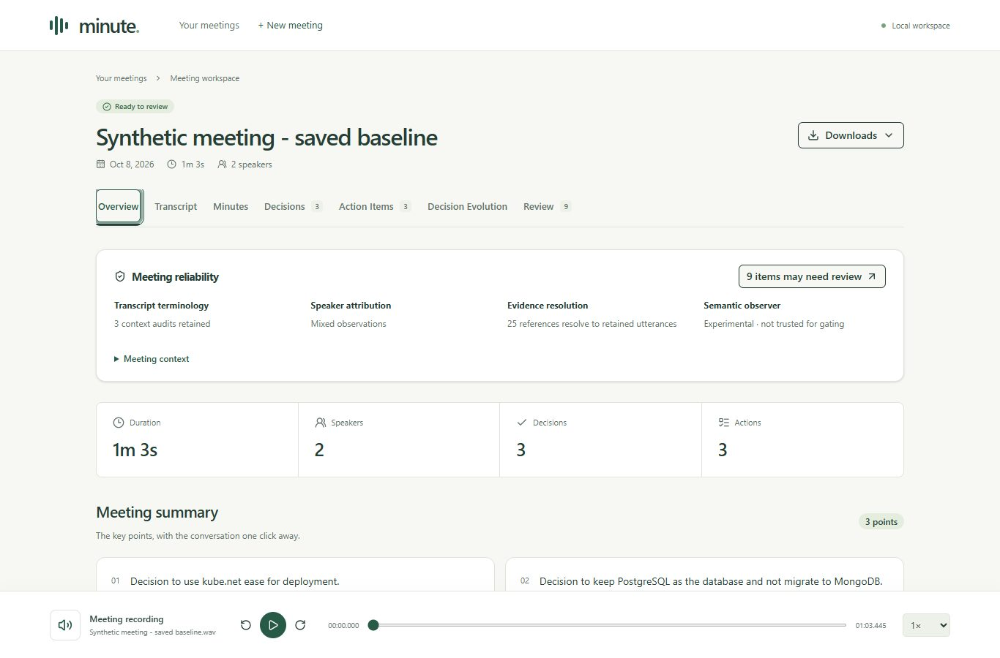

# Phase XI validation — 2026-10-08

## Baseline and freeze

Before edits, inspected the existing package, web registry/store/path guards,
frontend evidence sheet/search/playback, tests and VIII–X serializers/source validators.
The repository already had a working six-stage canonical workflow and polished
React/Vite workspace. Typed immutable dataclasses and unittest coexist with Pydantic
web DTOs and Vitest/Testing Library frontend tests. Existing uncommitted VIII–X work
was preserved, rather than comparing this phase to an older Git HEAD.

Baseline: **757 Python tests, 733 passed / 24 skipped**; **21 frontend tests passed**.
ESLint, TypeScript, Vite build, Ruff, formatting, compilation and main-environment
`pip check` passed. Vite's existing Radix `use client` directive warnings were present
at baseline and remain nonfatal.

SHA-256 snapshots of existing source/frontend/test/script files were recorded in
ignored `.validation/phase11/baseline-hashes.json`; changed-file comparison is in
`changed-hashes.json` and `regression-hashes.json` (266 existing files checked).
The only pre-existing Python file changed in XI is `web/app.py`.
All existing ML code, schemas, prompts, policies, orchestration, registry, configuration,
dependency files and scripts remain byte-identical to this phase's baseline.

## Automated results

| Check | Result |
|---|---|
| Complete Python suite | **772 tests: 747 passed, 25 skipped**, 66.244 s |
| New web diagnostics tests | 15 tests; included in complete suite |
| Real FFmpeg ingestion integration | Existing 13 integration tests ran with required FFmpeg flag |
| Frontend | **37 passed**: 21 existing + 16 new |
| ESLint / TypeScript | Passed |
| Vite production build | Passed; baseline directive warnings retained |
| Ruff lint / format | Passed; 213 Python files formatted |
| Python compilation / main venv pip check | Passed |

The added native symlink test is skipped because this Windows account cannot create
symlinks. A separate simulated Windows-reparse test passes without privileges.
Other skips retain existing optional live/model-test requirements. All live API,
contextual ASR, secondary diarizer, semantic/Jev and primary ML test flags were disabled.
No new model or cloud inference ran during XI.

Backend tests cover quiet missing results, available DTO projections, unavailable
observations, context hash tampering, different source audio, ambiguous bundles,
malformed JSON, UUID/traversal rejection, cross-meeting registry containment,
symlink/reparse guards, bounded bundle count and source-label sanitization.
Inference functions are patched to raise during reads; canonical bytes remain unchanged.

Frontend tests cover qualitative badges, count mismatch, real detail labels,
successful/failed contextual hypotheses, experimental verification, controlled
timeline/navigation, empty states, review ordering/filtering/MIXED limits, quiet network
failure, canonical loading while diagnostics remain pending, shared playback/evidence
and the retained source-search/jump/bounded-audio regressions. Controlled timeline
fixtures test software behavior, not semantic model accuracy.

## Actual saved-record browser run

A separate ignored validation job was assembled by copying matching, **unchanged saved
artifacts**, not generating inference. It uses the existing 63.445-second Windows SAPI
two-voice synthetic recording. Original jobs were not modified. The matching retained
speaker/refined/grounding/MeetingRecord sources and actual context, Sortformer comparison
and Julia result all passed the new reader's binding checks.

Observed: 2 canonical speakers, 3 decisions, 3 actions, 25 evidence references,
3 contextual hypotheses, 1 RELIABLE / 9 MIXED utterances, and 9 review entries
(3 terminology / 6 experimental semantic). No MIXED utterance crossed the queue's
20% disagreement display threshold. Julia had 3 isolated accepted proposal events,
no edges, and no useful evolution chain. The UI displays the honest empty evolution
state and retains canonical decisions normally. Existing ASR mistakes such as
`kube.net ease` and `Drant` stay visible; this is not a quality improvement claim.

Chrome was inspected interactively. Its extension viewport override did not change
the measured viewport, so exact-size responsive tests used an isolated headless
installed Chrome via the already bundled Playwright package; no browser was installed.

| Measured CSS viewport | Views checked | Horizontal document overflow |
|---|---|---|
| 1366 × 900 | Overview, Transcript, Evolution, Review | None |
| 1024 × 900 | Same four | None |
| 768 × 1024 | Same four | None |
| 390 × 844 | Same four | None |

All 16 viewport/view checks measured exactly one audio element. No page errors occurred.
Enter opens speaker details; Escape closes the sheet and returns focus to its badge.
Source playback starts at the retained 0.400 s. Terminology filtering gives 3 cards;
View transcript focuses `utt_000001`, clears search and highlights it. Reduced-motion
media emulation was enabled and CSS animation duration reduced to 0.00001 s; transcript
scrolling also respects that preference. Aborting all three optional HTTP reads leaves
the canonical summary visible and shows quiet diagnostic-load messages.
Mobile drawer Tab navigation stays inside the modal, with a measured document width
of 390 px. These are targeted accessibility checks, not a complete WCAG certification.

## Selected screenshot provenance

The five JPEG assets total approximately 383 KiB. They show the safe synthetic recording's
actual saved results, with no keys, local paths or private recording content.

| Asset | View |
|---|---|
| [Overview](assets/phase11/overview.jpg) | Separate reliability dimensions and review CTA |
| [Transcript](assets/phase11/transcript.jpg) | Qualitative speaker and context badges |
| [Evidence](assets/phase11/evidence-speaker.jpg) | Existing source drawer with speaker details |
| [Evolution](assets/phase11/decision-evolution.jpg) | Experimental warning and honest weak-result state |
| [Review](assets/phase11/review.jpg) | Deterministic queue, filters and canonical navigation |

## Remaining limits and Git

Diagnostics require pre-generated source-matching bundles inside the meeting workspace.
Multiple matching runs are intentionally unavailable until an explicit selection policy
is added. Large sidecars exceeding read budgets fail safely. No context-upload UI,
observer rerun, persistent review state or semantic gating was introduced. Semantic
accuracy remains poor, and speaker agreement is not ground truth.

New/modified UI, read-only web DTO/readers/routes, tests, documentation and selected
images remain uncommitted. Earlier VIII–X changes remain in place. Models, job files,
benchmark output, browser logs and validation hashes stay ignored; no weights are tracked.
No commit or push was performed in XI.
